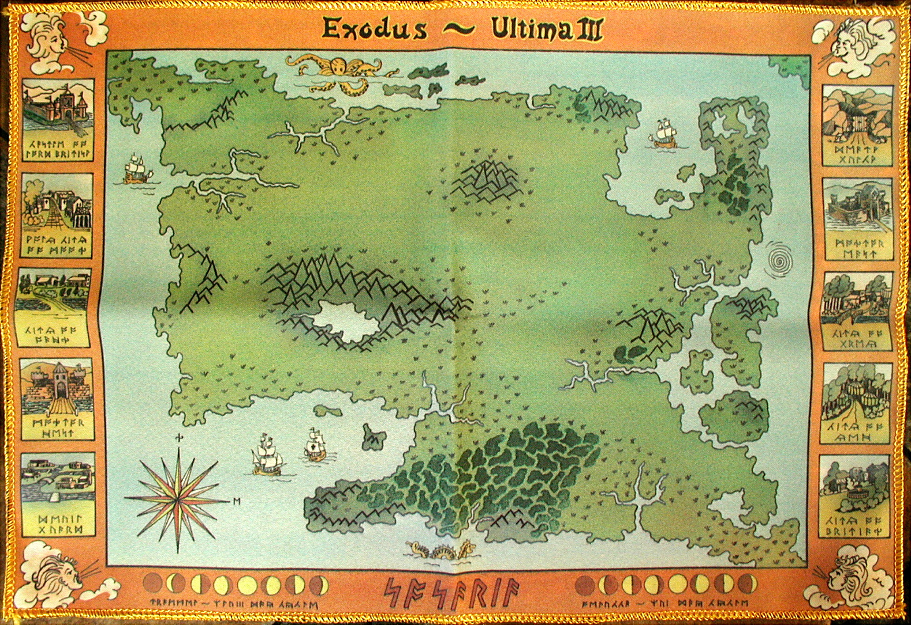
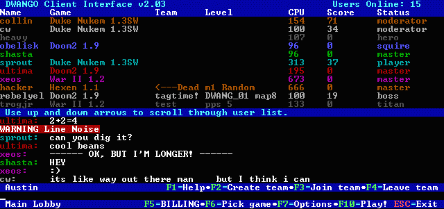
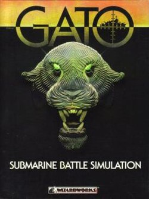

# Computer Gaming

I've been playing computer games in one form or another since 1985.
I had to know enough about MS-DOS to run the games in the pre-Windows days.

## My First Game

My first computer game, a role-playing game on an IBM PC, was [Ultima III](https://en.wikipedia.org/wiki/Ultima_III:_Exodus) by Origin Systems.
I remember installing and playing the game a while before digging into the documentation.  I think there were 3 20-page manuals that came with the game.  The documentation (and additional cloth map) gave me an impression that the creators were really into creating their own world.

## Online Multiplayer

As I grew older I played more complex games (including others in the Ultima series) and eventually got into first-person shooters like [Doom](https://en.wikipedia.org/wiki/Doom_(1993_video_game)) and [Quake](https://en.wikipedia.org/wiki/Quake_(video_game)).
In 1995, I discovered [DWANGO](https://en.wikipedia.org/wiki/DWANGO) and was able to play online multiplayer games for the first time.  I was hooked.

## Submarine Games

I'm betting that my choice to enter the Navy as a submariner probably came from my exposure to several submarine computer games.
I will say there's a lot more action in the games (and less cleaning and maintenance) than in real life.

I remember specifically playing:
- Gato
- Silent Service
- Silent Serice II
- 688 Attack Sub

## Massively Multiplayer Online Role-Playing Games (MMORPGs)

The first MMORPG I'd played was [Asheron's Call](https://en.wikipedia.org/wiki/Asheron%27s_Call) in 1999.  It really reminded me of the RPG that entered me into PC gaming, and it added the ability to play with others.
I actually believe that playing games of this nature made me very resistant to real life scams and also cemented in my mind that you almost always have to be a team player in order to succeed in these games.

I'd played multiple other MMORPGs and actually met my girlfriend while playing [Final Fantasy XI](https://en.wikipedia.org/wiki/Final_Fantasy_XI).