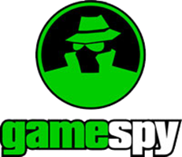

# Tournament Hosting

I used to volunteer for _[MPlayer.com](https://en.wikipedia.org/wiki/MPlayer.com)_ and later _[Gamespy Arcade](https://en.wikipedia.org/wiki/GameSpy_Arcade)_ as a Tournament Host when those services were still live.
The program was called the "Wizards" program and was separated into different genres covering the game types that the platform was hosting.  I fell into the Action genre and would usually volunteer once a week to engage with a specific gaming community.

 

There were usually three Wizards assigned to run the tournaments.  The roles usually consisted of:
- **Matchmaker** - The Wizard assigned here would normally create the brackets, track the player results, and resolve gameplay disputes.
- **Live web** - The matchmaker would normally feed the information to the live web Wizard so that tournament participants could track the progress in real time on the page displayed in the tournament lobby.
- **Moderator** - The moderator Wizard would usually serve as the event MC, lead for the event, and would submit the results to MPlayer/Gamespy Arcade for reward distribution.