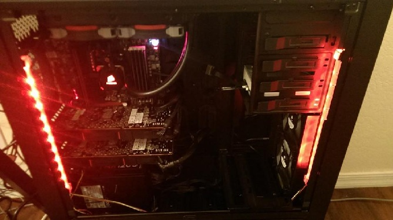
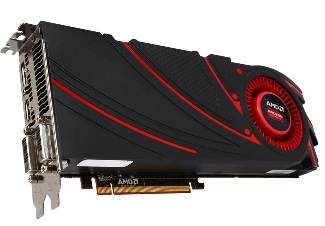
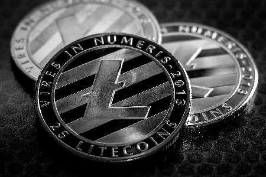
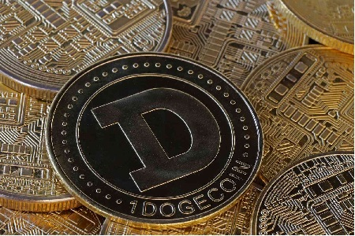

# Cryptocurrency Mining

I used to mine [cryptocurrency](https://en.wikipedia.org/wiki/Cryptocurrency) (specifically alt coins) back when the difficulty was lower via graphics cards.
There's obviously no point to it now, via GPUs, as there are ASICs that do this far better today.

I'd previously used 2x _AMD R9 290X_ graphics cards to mine both Litecoin (LTC) and Dogecoin (DOGE) in a mining pool in 2013.

After mining them, I'd trade back and forth on _Crypsy.com_ (before it was shut down) for 10% gains via limit orders:
- **LTC --> DOGE**
- **DOGE --> LTC**

| Litecoin  (LTC)        | Dogecoin   (DOGE)        |
|------------------------|--------------------------|
|  |  |
