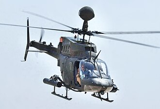

import Tabs from '@theme/Tabs';
import TabItem from '@theme/TabItem';

# Introduction

<Tabs>
    <TabItem value="work" label="Work-Related" default>

        I'm a Senior Technical Writer that took a non-traditional path into this career.
        I do not have a formal degree and actually started technical writing as a collateral duty while I was in the Navy.

        I was one of two people in my division designated to go to a QAI (Quality Insurance Inspector) school.
        A [SUBSAFE](https://en.wikipedia.org/wiki/SUBSAFE) valve had to be replaced during one of the refit periods; I was assigned to that task.
        I wrote my first CWP (Controlled Work Package) and successfully had the valve replaced and tested prior to the upcoming patrol.
        I did not know then that my post-military career would eventually end up in the Technical Writing field.

        :::info

        The Submarine Safety Program (SUBSAFE) is a quality assurance program of the United States Navy designed to maintain the safety of its submarine fleet, specifically, to provide maximum reasonable assurance that submarine hulls will stay watertight, and that they can recover from unanticipated flooding.

        It was brought about after the loss of the _USS Thresher (SSN-593)_ in 1963.

        :::

        I've served as a Technical Writer in the following roles/fields:

        | Field                                       | Tools used                                            | Work Accomplished                                                                                                                                                                                                                  |
        |---------------------------------------------|-------------------------------------------------------|------------------------------------------------------------------------------------------------------------------------------------------------------------------------------------------------------------------------------------|
        | Military United States Navy             | Interleaf, Visio, Vulcan CMS                          | Creating and revising Ohio-Class submarine Troubleshooting documentation Fault Indication Index/Fault Isolation Tree (FII/FIT) [IETMs](https://en.wikipedia.org/wiki/Interactive_electronic_technical_manual) and OP 4628/4629 |
        | Commercial United States Postal Service | Epic Editor and Astoria CMS                           | Created a 44,000 page manual for sorting machine called the [Flats Sequencing System](https://en.wikipedia.org/wiki/Flats_Sequencing_System) (FSS)                                                                                 |
        | Military United States Army             | FrameMaker (structured)                               | Created a 1,000 page Operator's Manual and a 10,000 page Maintenance Manual for the [Buffalo A2 MRAP](https://en.wikipedia.org/wiki/Buffalo_(mine_protected_vehicle))                                                              |
        | Aviation Honeywell, Boeing, Airbus      | Epic Editor, FrameMaker, and Techsight/X CMS          | Both new creation and _recreate & revise_ projects for around 100 Lighting and Networking Manuals                                                                                                                                  |
        | Semiconductor Microserver and Storage   | FrameMaker, WebTop CMS, multiple publishing locations | Creating and revising External Design Specifications, Platform Design Guides, BIOS Writers Guides, Specification Updates, and so on                                                                                                |
        | Semiconductor Foundry                   | Oxygen XML Author, Alfresco CMS, GitHub               | Creating and revising Platform Design Kits, Reliability Tool Kits, Design Rules, and so on                                                                                                                                         | |

        I've used multiple tools and Content Management Systems to produce documentation, but find that I really love a "Docs as Code" setup.

        I believe that a good Project Manager needs to be able to `adapt` to changing scopes and shifting deadlines, must be `consistent` with steps in a workflow and create a recognizable set of expectations for SMEs, and must `communicate` changes to the Program Manager, SMEs, and other Technical Writers to keep everyone synced.
        The left hand must know what the right hand is doing.

        ## Summary

        - Resilient Technical Writer with over 22 years' experience providing documentation ranging from weekly distributions to in-depth maintenance manuals (20 to 44,000 pages) covering military, aerospace/aviation, commercial/industrial, and semiconductor industries.
        - Skilled in facilitating maintenance including troubleshooting and repairing of various electrical, mechanical, hydraulic, and pneumatic Strategic Weapon System (SWS) equipment.
        - Adept in the use of Adobe Creative Suite and Microsoft Office Professional applications including the following:
            - Adobe Acrobat Professional
            - Microsoft Access, Excel, Outlook, PowerPoint, Project, Word, and Visio.
        - Proficient in the use of a multitude of documentation authoring and editing programs (HTML/SGML/XML), content management systems (CMS), and model viewing software including the following:
            - Interleaf (TPS) / Quicksilver
            - XML/DITA - Arbortext Epic Editor / XMetaL / Oxygen / Intel Product Information XML (IPIX)
            - Adobe Dreamweaver and FrameMaker (Structured and Unstructured)
            - Astoria, Vulcan, WebTop/InfoFactory, Alexandria, TechSight/X, and Alfresco Content management Systems
            - GitHub
            - Anacapa and Registered Content Service (RCS)
            - SharePoint
            - Autodesk Design Review
            - 3dVia Composer / SOLIDWORKS
            - Previously held Department of Defense TOP SECRET [SIOP](https://en.wikipedia.org/wiki/Single_Integrated_Operational_Plan)-ESI (today's equivalent is NC2-ESI) security clearance and maintained active status in the Nuclear Weapon [Personnel Reliability Program (NPRP)](https://en.wikipedia.org/wiki/Personnel_Reliability_Program).
    </TabItem>
    <TabItem value="personal" label="Personal">

        I was born in Mainz, Germany.

        My first language was actually German.  My ability to speak German these days has suffered; I haven't been able to practice much.  I do find that I still understand what is being spoken, especially when watching TV.

        My father was a helicopter ([OH-58D Kiowa](https://en.wikipedia.org/wiki/Bell_OH-58_Kiowa)) pilot in the United States Army through the aviation Warrant Officer program.

        

        This caused us to move around a lot as my father would receive orders.  I was perpetually the "new kid" in school.
        My eventual orders and contract jobs aided this as well.

        I've lived in the following locations:
        - Mainz, Germany
        - Baumholder, Germany
        - Fort Ord, California
        - Ozark, Alabama
        - Furth, Germany
        - Fort Rucker, Alabama
        - Ansbach, Germany
        - Fayetteville, North Carolina
        - Great Lakes, Illinois
        - Orlanda, Florida
        - Groton, Connecticut
        - Newport, Rhode Island
        - Kingsland, Georgia
        - Charlotte, North Carolina
        - Fairfax, Virginia
        - Germantown, Maryland
        - Summerville, South Carolina
        - Phoenix, Arizona
        - Gilbert, Arizona
    </TabItem>
</Tabs>

## Education

Graduated from _Seventy-First High School_ in _Fayetteville, North Carolina_.

Completed various advanced courses while in the US Navy.

| Course Name                                                         | CID        | Course Name                                              | CID        |
|---------------------------------------------------------------------|------------|----------------------------------------------------------|------------|
| Trident II Fire Control System Advanced Operation                   | A-121-0523 | Shipboard Security Engagement Tactics (SSET)             | K-830-2213 |
| Launcher Control Group Advanced Circuitry                           | A-121-0538 | Navy Leadership for PO2                                  | P-500-0025 |
| SWSS ICAS Advanced Maintenance                                      | A-121-0541 | Fire Fighting Indoctrination Course                      | X-777-0777 |
| Trident II D5 Advanced Missile Maintenance                          | A-121-0545 | M240 Patrol Operation and First Level Maintenance Course | Unknown    |
| Electrician's Mate "A" School                                       | A-661-0104 | Nuclear Weapons Radiological Controls (RADCON)           | Unknown    |
| Trident II Missile Technician Replacement Course                    | A-121-0563 | Oxygen Cleanliness Systems (02 Clean) and Components     | Unknown    |
| Advanced Targeting                                                  | A-121-0590 | Basic Enlisted Submarine Course                          | A-060-0011 |
| Submarine Force Quality Assurance Inspector (QAI)                   | A-557-0082 | Strategic Weapons "A" School                             | A-121-0142 |
| Maintenance Support Data System Advanced maintenance and Management | A-121-0550 |

