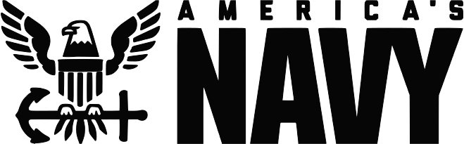

# USS Maryland / SSBN-738 Gold Crew
## Trident II D-5 Missile Technician (NEC-3311)
_King's Bay, GA (January 1996 - January 2002)_

- Executed various assignments involving nuclear weapons security, nuclear weapons safety, operation, maintenance,
and targeting of the Trident II D-5 (UGM-133) Strategic Weapon System.
- Qualified all Missile Technician watch stations including senior in-rate watch stations, Fire Control Supervisor and
Launcher Supervisor, and served as system troubleshooter for assignments involving Strategic Weapon System and
Fire Control System during normal evolutions and battle stations.
- Performed preventive and corrective maintenance ensuring 100% equipment and systems readiness, performed
equipment inspections and calibrations, and ensured compliance with all maintenance actions.
- Scheduled and maintained testing and divisional training, as the Divisional Training Petty Officer, to ensure that all
requirements were met and Missile Division maintained proficiency in multiple aspects of operation, troubleshooting
methods, qualifications, and battle stations scenarios.
- Created Controlled Work Packages (CWPs) and installed/tested SUBSAFE and Level II components in accordance
with the Navy Quality Assurance Program as the divisional Quality Assurance Inspector (QAI).