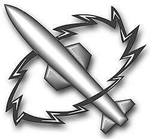
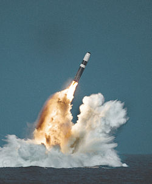

# United States Navy
## USS Maryland / SSBN-738 Gold Crew
**Trident II D-5 Missile Technician (NEC-3311)**

`King's Bay, GA (January 1996 - January 2002)`

### Resume Bullets

- Executed various assignments involving nuclear weapons security, nuclear weapons safety, operation, maintenance,
and targeting of the Trident II D-5 (UGM-133) Strategic Weapon System.
- Qualified all Missile Technician watch stations including senior in-rate watch stations, Fire Control Supervisor and
Launcher Supervisor, and served as system troubleshooter for assignments involving Strategic Weapon System and
Fire Control System during normal evolutions and battle stations.
- Performed preventive and corrective maintenance ensuring 100% equipment and systems readiness, performed
equipment inspections and calibrations, and ensured compliance with all maintenance actions.
- Scheduled and maintained testing and divisional training, as the Divisional Training Petty Officer, to ensure that all
requirements were met and Missile Division maintained proficiency in multiple aspects of operation, troubleshooting
methods, qualifications, and battle stations scenarios.
- Created Controlled Work Packages (CWPs) and installed/tested SUBSAFE and Level II components in accordance
with the Navy Quality Assurance Program as the divisional Quality Assurance Inspector (QAI).

### Details

I joined the Navy in 1996 and was initially designated as an Electrician's Mate.
I attended Electrician's Mate "A" School in Orlando, FL when the [Navy Nuclear Power Training Command (NNPTC)](https://en.wikipedia.org/wiki/Naval_Nuclear_Power_Training_Command) was based there.

| Electrician's Mate   | Missile Technician   |
|----------------------|----------------------|
|  |  |

I cross-rated to Missile Technician and attended Submarine School at New London Submarine Base in Groton, CT.
Missile Technician "A" School and Missile Technician "C" School followed before I was able to choose my submarine assignment.

In August 1997, I checked onboard the [USS Maryland (SSBN-738)](https://en.wikipedia.org/wiki/USS_Maryland_(SSBN-738)) Gold Crew.
I was assigned several collateral duties:
- Divisional Training Petty Officer
- Required Reading Petty Officer
- Data Recording System (DRS) Petty Officer
- Divisional Quality Insurance Inspector (QAI)
- Sound Silencing Petty Officer
- Swimmer Tender

#### FCET (Follow-on Commander's Evaluation Test)

We were able to launch two missiles to support FCET 21 in April 1999.
The FCET launches a specially modified missile without a nuclear payload, and is used to test the performance of the Trident missile system.
Northern Test Unit (NOTU) comes onboard and replaces the nuclear warheads with telemetry warheads and they install destruct sets, just in case a termination is required after launch.

#### SINKEX (Sink Exercise)

I also had the rare opportunity (as an Ohio-class submariner) to be part of a SINKEX with the _USS John F. Kennedy Battlegroup_ in October 2001.
The [Ex-USS Guam (LPH-9)](https://en.wikipedia.org/wiki/USS_Guam_(LPH-9)) was sunk for training as an artificial reef at _031° 14' 22.0" North, 071° 16' 35.0" West_ via a [Mark 48 ADCAP torpedo](https://en.wikipedia.org/wiki/Mark_48_torpedo) from the USS Maryland.

#### September 11, 2001

I was on patrol when the events of September 11 unfolded.
The immediate change in mood on the sub, the lack of information, and the difference between security when we left and when we came back are the only things I really remember well.

I did 6 hours of faulted targeting, as training, during the previous watch.
As I was walking towards my rack to get some rest before my next watch when I heard "Set [DEFCON](https://en.wikipedia.org/wiki/DEFCON) 3; station the targeting team."
The targets I'd entered then were clean, no faults anywhere. Everything was perfect.

Most of what we'd learned was copied via a satellite downlink and printed to paper.
We didn't get any footage until a later BSP brought it aboard so a lot of time was spent reading and rereading the printout.