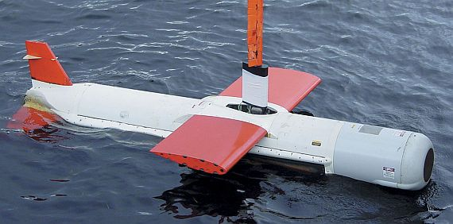

# BAE Systems
## Engineering Technologist III
**(FII/FIT) Fault Indication Indexes / Fault Isolation Trees (Procedures)**

`Silver Spring, MD (April 2003 – October 2007)`

### Resume Bullets

- Created new Fault Indication Indexes and Fault Isolation Trees (FII/FIT) for US Strategic Weapon System, Attack
Weapon System, and UK Strategic Weapon System.
- Developed process to convert paper FII/FITs to electronic Technical Information Databases (TIDB) and converted all
existing FII/FITs to an Interactive Electronic Technical Manual (IETM) format.
- Integrated Launcher System Control Group (LSCG) into currently existing Strategic Weapon System and Ship
Support Fault Isolation Trees.
- Analyzed developments in specific fields to determine the need for revisions, corrections and changes in previously
published materials, and the development of new materials.
- Assisted with development of new Fault Indication Indexes and Fault Isolation Procedures for the Guided Missile
Submarine (SSGN) Attack Weapon System.
- Represented BAE FII/FIT during SWS Weeks at King's Bay and Kitsap submarine bases to receive direct feedback
from fleet personnel and SWS contractors with respect to possible future changes or upcoming modifications and to
address any issues related to BAE developed content.
- Read, interpreted, and applied specifications from core drawings, cabling diagrams, schematics, technical manuals,
and other publications and source material to ensure correct troubleshooting paths and increase FIT accuracy.
- Developed Operating Procedures technical manual for use with Organic Post Mission Analysis (OPMA) workstations
following an AQS-20A mine detection SONAR deployment by MH-60S Seahawk helicopters.

### Details

This was my first official Technical Writing (SME) job.
I was hired as a subject-matter expert and was taught how to use [Interleaf](https://en.wikipedia.org/wiki/Interleaf) in order to make updates to the FII/FIT paper documentation in OP 4628 / OP 4629.
These were the same documents I was using as a troubleshooter, as the end user, while I was in the Navy.

Eventually most of the documentation was moved to CD-based IETMs that would be sent to the submarines as part of their documentation suite.
The troubleshooting procedures had to cover both the American [Ohio-class submarines](https://en.wikipedia.org/wiki/Ohio-class_submarine) and the UK [Vanguard-class submarines](https://en.wikipedia.org/wiki/Vanguard-class_submarine).

Most of the troubleshooting procedures would be authored in Visio initially before handing them off to the Technical Writers to convert.
The SMEs would have to answer trouble failure reports (TFRs) and attend "SWS Week" in order to get ahead of the upcoming modifications and upgrades to the systems.

I'd also participated in a side-project creating OPMA documentation for the AN/AQS-20A sonar mine countermeasure detection system.

