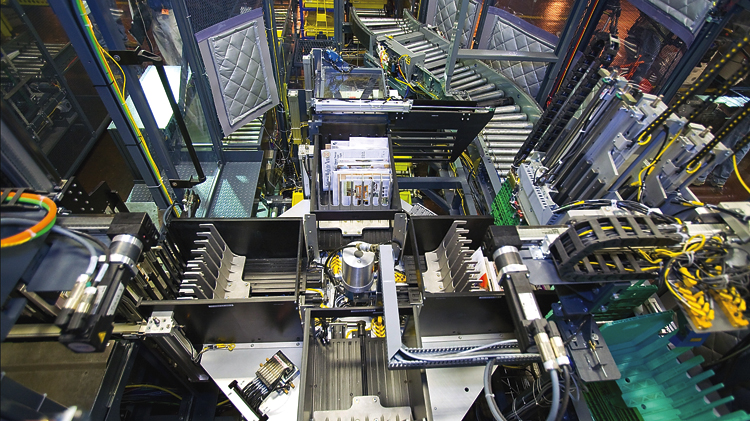

# Northrop Grumman
## Technical Writer
**Contractor - Technology Transfer Services (TTS)**

`Elkridge, MD (January 2008 – October 2009)`

### Resume Bullets

- Developed Handbook procedures for the United States Postal Service (USPS) automated Flats Sequencing System
(FSS) (Completed manual @ ~44,000 pages).
- Produced reusable content procedures that served as building blocks for larger procedures for Infeed Line,
Automated Tray Management System (ATMS), Automatic Bundle Separation Unit (ABSU), Carousel Electrical
Cabinet (CEC), and Integrated Tray Converter (ITC).
- Created and maintained tracking system to queue procedures for verification/validation and interfaced with team
leads to ensure priority procedures were designated and verification was completed prior to Northrop Grumman and
USPS validation.
- Served as validation team member with Northrop Grumman team leads to ensure comments and concerns generated
from supplier procedure validations were properly annotated in the Astoria Content Management System (CMS).

### Details

I was initially hired to create the reusable content procedures in the TTS satellite office in Elkridge, MD.
The machine was the size of a football field and contained multiple regions with different teams assigned.
Most of the reusable content covered similar procedures in different regions, regional power up procedures, regional power down procedures, and locators.

This was the first project that exposed me to DITA.  I didn't realize the full benefit until I caught a glimpse of the book map, region maps, and submaps.
We'd actually performed the procedures and documented the steps on the Northrop Grumman demonstrator model.

We took initial placeholder photographs and provided labels on those photos in accordance with the Handbook standard.
The procedures were authored in XML using those placeholder photographs until vector-based images could replace them later.

Northrop Grumman and USPS employees were tasked with validating our procedures as an independent party.
It was incredibly satisfying to see a potential end user using our documents to complete a task.

The final product (before the Carousel procedures were added) was estimated to be in the 44,000-page range.

