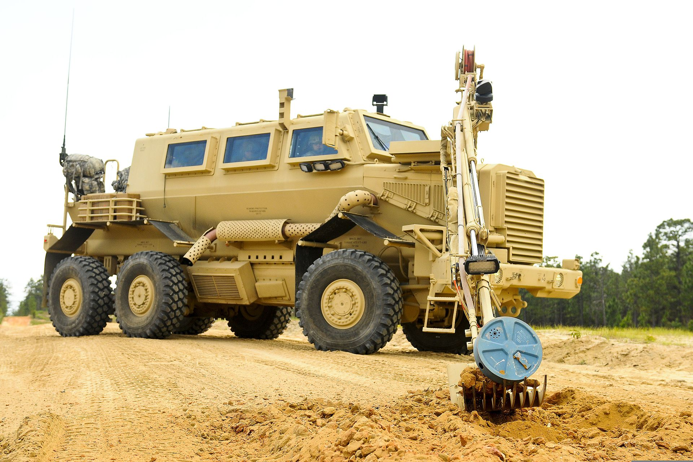

# Contractor - Precision Resources National
## Technical Writer - General Dynamics Land Systems - Force Protection
`Ladson, SC (March 2010 – July 2012)`

### Resume Bullets

- Developed Operations Manual (Completed manual @ ~1,000 pages), Maintenance Manual (Completed manual @
~10,000 pages), and Bar Armor Manual (Completed manual @ ~1,000 pages) for the Buffalo A2 Mine Resistant
Ambush Protected (MRAP) vehicle including removal and installation, assembly and disassembly, troubleshooting,
operational, and descriptive procedures.
- Coordinated correct parts with provisioning for Expendables and Durable Items List (EDIL), Mandatory Replacement
Parts List (MRPL), Repair Parts and Special Tools List (RPSTL), Tools Identification List (TIL), Basic Issue Items
(BII), and Components of End Item (COEI) to provide an accurate listing of tools and special equipment required for
sustainment of the Buffalo A2 MRAP.
- Created procedures covering multiple systems including the engine, transmission, brake system, fuel system,
automatic fire suppression system, and various components of the electrical system.
- Developed procedures under the guidance of MIL-STD-40051-2, MIL-HDBK-1222C, FPII Style Guide, and TACOM
instruction and produced procedural and narrative documentation in Adobe FrameMaker (structured).
- Used 3dVia Buffalo A2 models, Windchill, SharePoint illustration bank, COTS data from suppliers and vendors,
engineering data/schematics, and technical expert recommendations to develop, validate, and verify procedures,
parts data, and illustrations.
- Performed hands-on validation of procedures on the Program of Record (POR) Buffalo A2 to ensure technical
accuracy.

### Details

This was a difficult one!

The company was ramping up to deliver its first set of documentation for the Buffalo.
They DID NOT use a CMS. The books were authored in structured FrameMaker in accordance with MIL-STD-40051-2.

The company had acquired base designs from the South African government in order to develop heavily armored trucks featuring a V-hull design.
The documentation was very difficult to nail down due to the fact that the vehicle design was actively changing.
Many procedures that were written for an earlier version of the truck had to be rewritten as the design, parts, and models were updated.

There were as many as 50 writers at one point.
The Operator's Manual was accepted by Tank-Automotive & Armaments Command (TACOM) and further work went into the validation of the procedures for the Maintenance Manual.
The Army maintainers that would serve as the actual end users of our documentation were observed while performing the Maintenance Manual procedures.
Corrections, clarifications, and updates were made to the documentation before it was finally approved by TACOM.  The completed Maintenance Manual was 10,000 pages.

