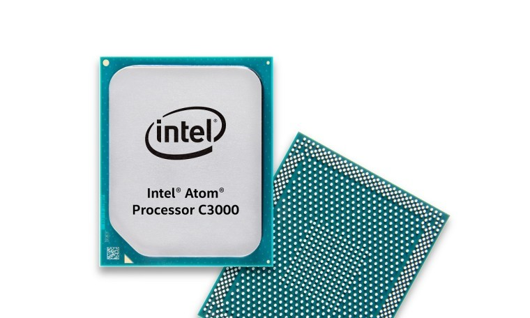

# Intel Corporation
## Senior Technical Writer - Data Center Group
**Contingent Worker / Intel - Data Center Group**

`Chandler, AZ (April 2014 – September 2020)`

### Resume Bullets

- Revised technical content of Intel proprietary documentation and presentations as specified by engineering
modifications, new product descriptions, and customer requirements using Adobe FrameMaker 11, Microsoft
PowerPoint, and Microsoft Visio.
- Utilized repository check-out and check-in of source files via WebTop for revision implementation, book creation and
development, comment incorporation via engineering shared reviews, editing and proofing of content, and delivery to
restricted secret (Anacapa or RCS) and confidential (CDI) repositories or Intel.com for customer and public access.
- Generated and distributed the message of the week (MoW) to field sales including information pertaining to
documents released, document updates, design issues, and other pertinent information.
- Interfaced with engineers to create and revise Engineering Design Specifications (EDS), BIOS Writer's Guides
(BWG), Specification Updates, Application Notes, Reference Board Manuals, Customer Readiness Test Plans
(CRTP), Datasheets, Platform Design Guides (PDG), Design-In Presentations, Platform Debug Port Specifications,
and Model User Guides (MUG).

### Details

#### Interview

I'd had the weirdest interview at Intel.  They only wanted to verify that I had sufficient FrameMaker knowledge.
The interview consisted of me demonstrating several very simple FrameMaker tasks that were presented to me on a printed sheet.
The entire exercise took about seven minutes.
I was originally hired as a contingent worker to cover the upcoming absence of an Intel employee while he took his 2-month sabbatical.

#### Data Center Group and Full Time Employee

While I was familiar with the tool and eventually became familiar with the workflow, this was the first time I'd been in a position where I was not serving as the content author.
Much of the documentation required direct SME support in multiple functional areas.

I eventually was hired as an Intel Contract Employee (ICE) and later as a full time employee.
Some of the public documentation can still be found if one searches for _Intel Atom® Processor C3000 Product Family Datasheet_.

Much of the publishing was determined by the classification of the documentation.
A collateral list and a Message of the Week (MoW) needed to be distributed to keep customers informed of new releases.

