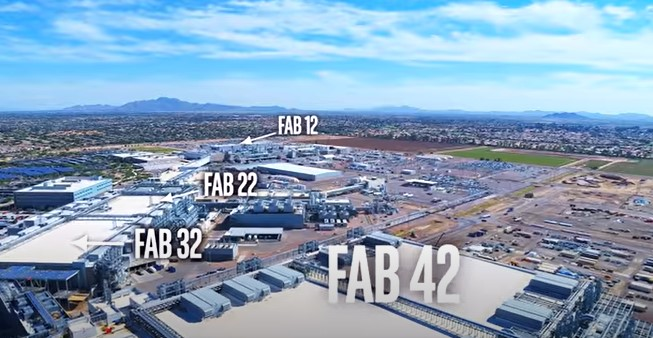

# Intel Corporation
## Technology Project/Program Manager - Technology Collateral Enablement Group
**IPPO TCEG2 Tech Pubs 2**

`Chandler, AZ (April 2018 – September 2025)`

- `Senior Technical Writer - Intel / April 2018 - September 2020`
- `Technology Project/Program Manager - Intel / September 2020 - September 2025`

### Resume Bullets

- Revised technical content of Intel Kit documentation, Reliability Design Rules, Training Modules, and presentations
using Adobe FrameMaker, Microsoft PowerPoint, Microsoft Visio, Oxygen XML Author, and GitHub.
- Interfaced with developers, engineers, and Functional Area owners to create and revise the following documents
through their life cycle:
  - Platform Design Kits (PDK) / Common Platform Design Kits (CPDK)
  - ASIC Design Flow Kits (ADF) / Cadence Stylus Modules (CSM)
  - Radio Frequency Kits (RF)
  - Reliability Verification Flow Kits (RVF) / Reliability Tool Kits (RTK)
  - Custom Tool Kits (CTK) / Utilities Tools Kits (UTK)
  - Static Random-Access Memory Kits (SRAM)
  - Tape-in Collateral Kits (TIC)
  - Halo Kits
- Managed the maintenance of the Reliability Design Rules documents including:
  - Technology Envelope
  - Transistor Reliability
  - ESD and Latchup Design Rules
  - Electromigration and Self-Heat Design Rules
  - Bump Imax Current Design Rules
  - Interconnect Dielectric Reliability

### Details

In 2018, I applied for a Technical Writer positon in the Intel Custom Foundry (later Intel Foundry Services) group.  Our jobs were eventually retitled as Project/Program Managers in September 2020.

Most of the documentation created in this group was for the _Intel 3_, _Intel 18A_, and _Intel 14A_ processes.

This was a mostly a remote position, initially due to COVID, and required interfacing with around 280 SMEs across 15 functional groups.
Some of the functional groups, like ASIC and Reliability Verification, were based out of Bangalore.
The ability to pop on quickly in the evening to get a question answered really helped to ensure that we weren't playing E-mail tag when a deadline was approaching.

The PDK documentation usually referred to design materials, API references, and technology data that described a [Process Design Kit](https://en.wikipedia.org/wiki/Process_design_kit).

Most of the documentation was written in XML/DITA, was hosted in GitHub, and used an in-house tool to solicit inputs from the SMEs.
JIRA was used for opens and carry forwards.

The most difficult part of the documentation process when I first arrived involved classifying information in the XML for different customers.
PDK releases usually required multiple "slices" (up to 8) of the documentation that targeted specific vendors and customers.
We had to ensure that a specific-slice "A" did not include specific-slice "B" information despite the fact that both slices came from the same source.

